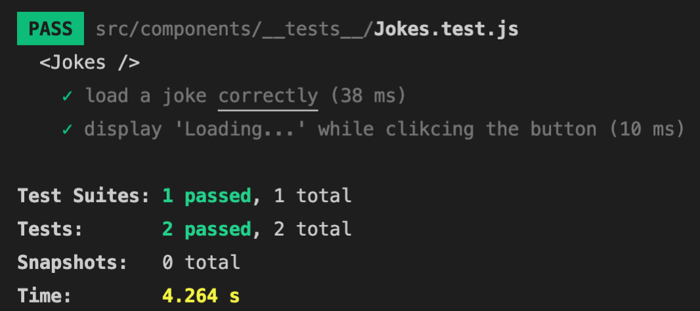
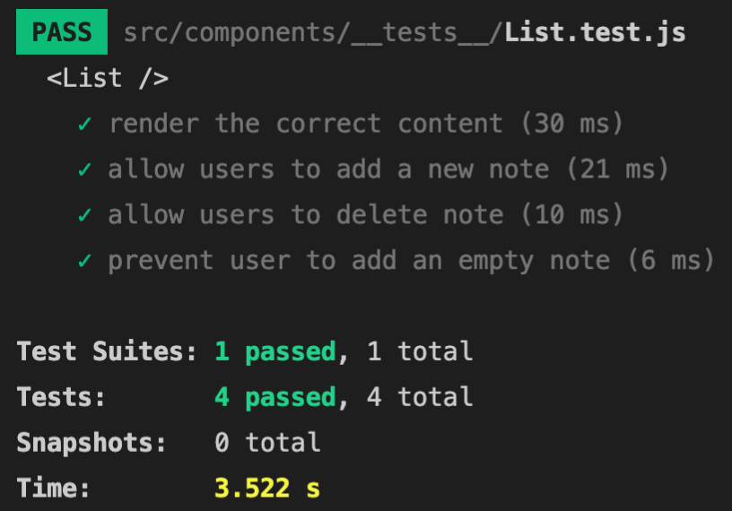

# Introduction

The purpose of this app is to use JavaScript Testing Framework `Jest`. The purpose of unit testing is to validate that each unit of the software performs as designed.

## What I learnt

Software testing is important because if there are any bugs or errors in the software, they can be identified early and fixed before the software product is delivered. Before reading Jest's documentation, I was asking myself: *what exactly should I test?* To answer this question, I found many types of software tests that can be found [here](https://www.softwaretestinghelp.com/types-of-software-testing/).   
For this project, I decide to use a mix of end-to-end tests with unit testing. For the first test, I wanted to know how end users would interact with the application (`<List />`) and if the output met the application logic.   
The second test I conducted t was to mock an API (`<Jokes />`). I have mixed feelings regarding mocking fetch, as I found articles/comments that mocking of API is overused or necessary.  
The results can be summed up that no matter how small the test is, I need to make sure the components are rendering.

## Results

`<Jokes />` test screenshot

`<List />` test screenshot

## Getting Started with Create React App

This project was bootstrapped with [Create React App](https://github.com/facebook/create-react-app).

## Available Scripts

In the project directory, you can run:

### `npm start`

Runs the app in the development mode.\
Open [http://localhost:3000](http://localhost:3000) to view it in the browser.

### `npm test`

Launches the test runner in the interactive watch mode.\
See the section about [running tests](https://facebook.github.io/create-react-app/docs/running-tests) for more information.

## Learn More

You can learn more in the [Create React App documentation](https://facebook.github.io/create-react-app/docs/getting-started).

To learn React, check out the [React documentation](https://reactjs.org/).